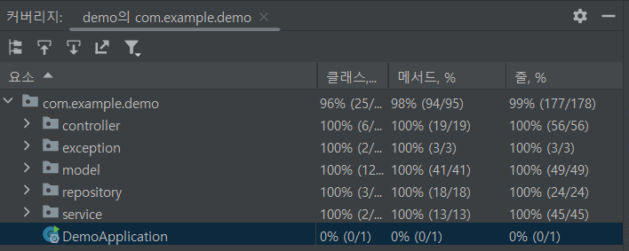

# Toy for test on spring!

해당 레포지토리는 테스트 코드 추가를 위한 토이 프로젝트 입니다.
코드가 얼마나 정상 동작하는지, 프로덕션에서 잘 동작하는지를 검증하지는 말아주세요.
스프링에 테스트를 넣는 과정을 보여드리기 위해 만들어진 레포지토리입니다.
당연히 완벽하지 않습니다.

## 실행하기

### 00. 바로 시작

h2를 이용하여 `auto create table`을 하고 있기 때문에 바로 실행이 가능합니다.

### 01. 이메일 인증

> 단 이 프로젝트는 사용자가 가입할 때 이메일 인증을 하기위해 메일을 발송하는 코드가 있습니다.

이메일이 제대로 발송되는지 확인해보고 싶으신 분들은 [해당 document 파일](./document/connect-mail-sender.md)을 따라해주세요.
관련된 자료는 라이브러리나 Gmail 정책에 따라 UI와 방법이 달라질 수 있습니다.
최신화 된 정보를 제공하지 않으니, 가급적 문서를 참조해주시고, contribution 해주시면 감사하겠습니다.
### 02. 테스트 코드 준비
```agsl
@ExtendWith(SpringExtension.class)
```
일반적으로 스프링부트 프로젝트를 만들면 나오는 @SpringBootTest 어노테이션은 전체 어플리케이션 컨텍스트를 로드하게 됨 <br>
그래서 테스트를 할 때마다 전체 어플리케이션 컨텍스트를 로드하게 되어 테스트가 느려지는 단점이 있음 <br>
필요한 부분만 테스트할 때는 해당 어노테이션을 사용하는 게 맞음 <br>
<br>
```agsl
@DataJpaTest
```
스프링 데이터 JPA 관련된 설정만 로드함 <br>
근데, @ExtendWith 어노테이션을 사용하지 않아도 됨 (내장되어 있음) <br>
```angular2html
@AutoConfigureMockMvc
@AutoConfigureTestDatabase
```
MockMVC 설정하는 어노테이션<br>
내장된 데이터베이스를 사용하는 어노테이션


### 레이어 패턴의 테스트 
**테스트 커버리지**


## 소소하긴 한데 몰랐음
* find: Optional을 반환한다는 의미로 많이 사용
* get: 애초에 데이터가 없으면 에러를 던진다는 의미가 내포되어 있음

## 관리 도구로 바로가기

- [h2-console](http://localhost:8080/h2-console)
- [Openapi-doc](http://localhost:8080/swagger-ui.html)