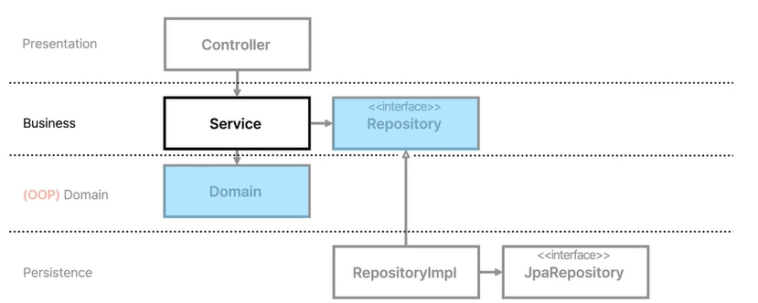
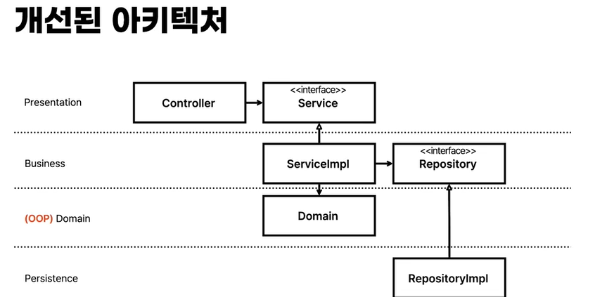

# Toy for test on spring!

해당 레포지토리는 테스트 코드 추가를 위한 토이 프로젝트 입니다.
코드가 얼마나 정상 동작하는지, 프로덕션에서 잘 동작하는지를 검증하지는 말아주세요.
스프링에 테스트를 넣는 과정을 보여드리기 위해 만들어진 레포지토리입니다.
당연히 완벽하지 않습니다.

## 실행하기

### 00. 바로 시작

h2를 이용하여 `auto create table`을 하고 있기 때문에 바로 실행이 가능합니다.

### 01. 이메일 인증

> 단 이 프로젝트는 사용자가 가입할 때 이메일 인증을 하기위해 메일을 발송하는 코드가 있습니다.

이메일이 제대로 발송되는지 확인해보고 싶으신 분들은 [해당 document 파일](./document/connect-mail-sender.md)을 따라해주세요.
관련된 자료는 라이브러리나 Gmail 정책에 따라 UI와 방법이 달라질 수 있습니다.
최신화 된 정보를 제공하지 않으니, 가급적 문서를 참조해주시고, contribution 해주시면 감사하겠습니다.
### 02. 테스트 코드 준비
```agsl
@ExtendWith(SpringExtension.class)
```
일반적으로 스프링부트 프로젝트를 만들면 나오는 @SpringBootTest 어노테이션은 전체 어플리케이션 컨텍스트를 로드하게 됨 <br>
그래서 테스트를 할 때마다 전체 어플리케이션 컨텍스트를 로드하게 되어 테스트가 느려지는 단점이 있음 <br>
필요한 부분만 테스트할 때는 해당 어노테이션을 사용하는 게 맞음 <br>
<br>
```agsl
@DataJpaTest
```
스프링 데이터 JPA 관련된 설정만 로드함 <br>
근데, @ExtendWith 어노테이션을 사용하지 않아도 됨 (내장되어 있음) <br>
```angular2html
@AutoConfigureMockMvc
@AutoConfigureTestDatabase
```
MockMVC 설정하는 어노테이션<br>
내장된 데이터베이스를 사용하는 어노테이션


### 레이어 패턴의 테스트 
**테스트 커버리지**

<br><br><br>
**_FIXME_** <br>
* 모든 테스트가 h2를 필요로 함
  * 문제점
    * 중형 테스트가 되기 때문에, 테스트 부담이 큼
    * ElasticSearch를 사용하는 경우, Embedded DB가 없기 때문에, 테스트가 불가능함 ➡️ 잘못된 테스트
* 원인 : _레이어드 아키텍처_
* DB 위주의 설계를 하게 만듦
* 동시 작업을 하게 됨 (Repository - Service - Controller 순으로 만들어야 작업이 가능함.)
* 도메인(비즈니스 문제를 해결하는 객체 모델)이 죽음 
  * 도메인 레이어를 만들고, 기존의 서비스가 하던 역할을 도메인 레이어로 옮겨야 함
  * **도메인과 영속성 객체를 구분하겠다** 라는 의미
#### 의존성 역전으로 문제 해결

이런 식으로 전개하게 되면

서비스 레이어는 기존에 데이터베이스에 지나친 의존을 하고 있었다.<br>
이를 도메인 레이어를 생성하고,<br>
레포지토리 인터페이스를 만들고, 레포지토리에 대한 의존성 역전을 했다 <br>
<br>
컨트롤러는 지금까지 서비스를 의존하고 있었다.<br>
서비스 인터페이스를 만들고, 서비스에 대한 의존성 역전을 했다.<br>

--> 이제 모든 외부 모듈에 대해서 의존성 역전을 하겠음<br>
_외부 모듈: 데이터베이스, 메일 발송, 외부 API, 외부 서비스 등등_<br>
---> 그래서, Persistence Layer는 **Infrastrucutre Layer**로 변경하겠음<br>
----
## 테스트 코드 및 아키텍처 개선
### 테스트 코드 개선
#### 패키지 관리 + DIP
도메인 별로 레이어를 가진다.
#### 패키지 의존성: 순환 참조
예를 들어, `posts` 도메인을 `users` 도메인에 의존하게 되면, `users` 도메인을 테스트할 때, `posts` 도메인을 테스트해야 한다.<br>
➡️ 소프트웨어공학에서는 **해악**이라고 보고 있음
#### Jpa 엔티티와 도메인 모델을 분리
모델 + Entity : JPA 엔티티<br>
모델 : 비즈니스 모델<br>
#### setter를 없애고, domain/vo로 로직 이동
#### CQRS: Command and Query Responsibility Segregation
* 명령은 상태를 바꾸는 메소드<br>
  void 타입이어야 함
* 조회는 값을 반환하는 메소드<br>
  상태를 변환해서는 안 됨<br>
  반환 타입이 있어야 함

➡️ Repository 대신 Reader/Writer

----

## 소소하긴 한데 몰랐음
* find: Optional을 반환한다는 의미로 많이 사용
* get: 애초에 데이터가 없으면 에러를 던진다는 의미가 내포되어 있음

#### Atomics 클래스
Thread-safe로 구현되어 멀티스레드에서 syncronized 없이 사용할 수 있으며, 성능도 좋음
원자적 연산을 지원하게 됨
* 카운터
* 성능 최적화 : synchronized를 사용하지 않고, 성능을 최적화 할 수 있음
* 값이 동시에 변하는 것을 막음

서비스 레이어 테스트를 소형 테스트로 만들기 위해 사용됨 (ID 생성)

## 관리 도구로 바로가기

- [h2-console](http://localhost:8080/h2-console)
- [Openapi-doc](http://localhost:8080/swagger-ui.html)